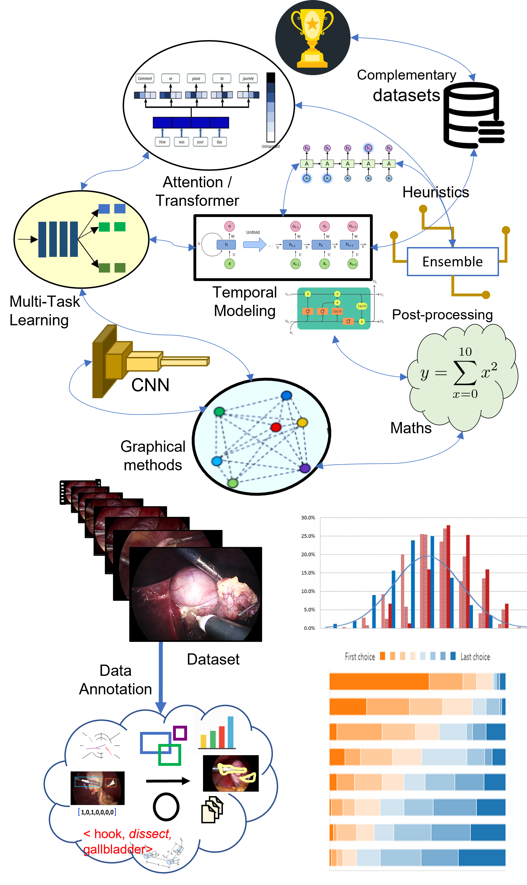
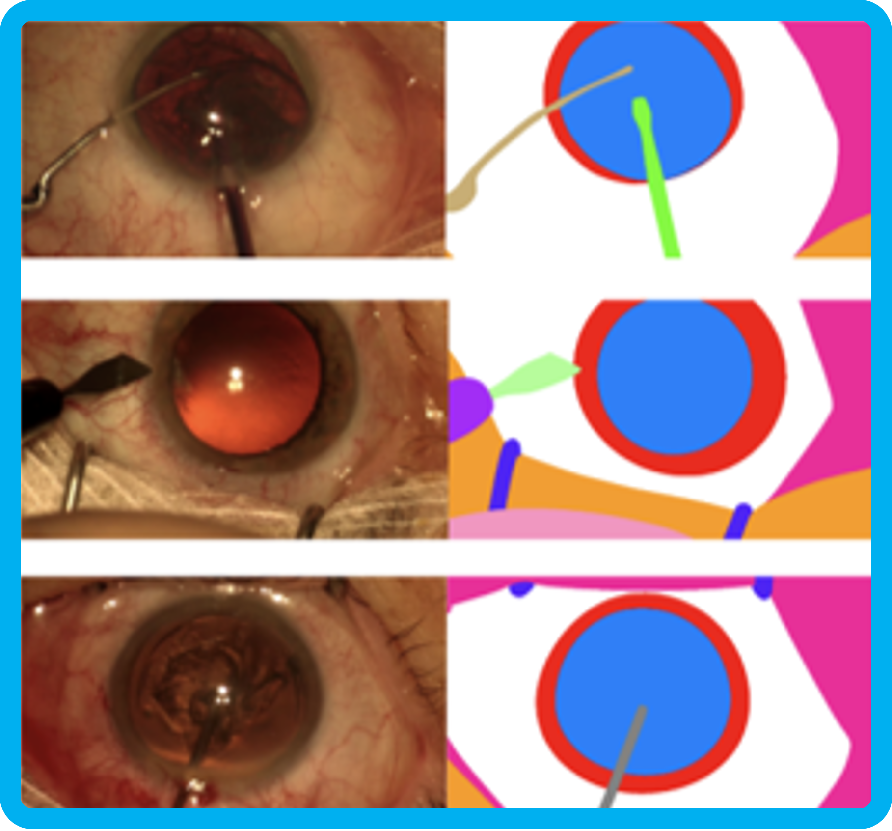

# 
> I'm interested in computer vision, machine learning, optimization, and image processing. 
Much of my research is about the use of these AI method for the analysis and modeling of surgical activities using real endoscopic videos. 
Representative papers are highlighted.

## Selected publications
<table>
  <!--- paper 8 -->
  <tr>
    <td colspan=2 style="color:#4B9CD3"><b>Data Splits and Metrics for Method Benchmarking on Surgical Action Triplet Datasets</b></td>
  </tr>
  <tr>
    <td style="padding:2.5%;width:25%;vertical-align:middle;min-width:120px">
        
    </td>
    <td>
      <i style="font-size:75%; color:purple">C.I. Nwoye, and N. Padoy</i>  
      
        This work introduces the standard splits for the CholecT50 and CholecT45 datasets and show how they compare with existing use of the dataset. CholecT45 is the first public release of 45 videos of CholecT50 dataset. We also develop a metrics library, <i>ivtmetrics</i> (now an open-source project), for model evaluation on surgical triplets. Furthermore, we conduct a benchmark study by reproducing baseline methods in the most predominantly used deep learning frameworks (PyTorch and TensorFlow) to evaluate them using the proposed data splits and metrics and release them publicly to support future research. 
       
      <code class="dest">arXiv report (...updating state-of-the-arts...)</code> 
       
      
        <a href="https://arxiv.org/pdf/2204.05235.pdf">arXiv</a> / 
        <a href="https://github.com/CAMMA-public/attention-triplet">code</a> / 
        <a href="">bibtex</a> 
      
    </td>
  </tr>
  <tr><td colspan=2 style="color:blue">
 
</td></tr>
  
  
  <!--- paper 7 -->
  <tr>
    <td colspan=2 style="color:#4B9CD3"><b>Dissecting Self-Supervised Learning Methods for Surgical Computer Vision</b></td>
  </tr>
  <tr>
    <td style="padding:2.5%;width:25%;vertical-align:middle;min-width:120px">
        
    </td>
    <td>
      <i style="font-size:75%; color:purple">S. Ramesh, V. Srivastav, D. Alapatt, T. Yu, A. Murali, L. Sestini, C.I. Nwoye, I. Hamoud, A. Fleurentin, G. Exarchakis, A. Karargyris, N. Padoy</i>  
      
        In this work, we address this critical need by investigating four state-of-the-art SSL methods (MoCo v2, SimCLR, DINO, SwAV) in the context of surgical computer vision. We present an extensive analysis of the performance of these methods on the Cholec80 dataset for two fundamental and popular tasks in surgical context understanding, phase recognition and tool presence detection. We examine their parameterization, then their behavior with respect to training data quantities in semi-supervised settings. Correct transfer of these methods to surgery, as described and conducted in this work, leads to substantial performance gains over generic uses of SSL...
       
      <code class="dest"><i>Submitted to</i> Medical Image Analysis 2022 (IF: 8.545)</code>    
       
      
        <a href="#">journal</a> /
        <a href="https://arxiv.org/pdf/2207.00449.pdf">arXiv</a> / 
        <a href="#">poster</a> / 
        <a href="#">supplement</a> / 
        <a href="https://github.com/CAMMA-public/SelfSupSurg">code</a> / 
        <a href="#">bibtex</a> 
      
    </td>
  </tr>
  <tr><td colspan=2 style="color:blue">
 
</td></tr>
  
  
  <!--- paper 6 -->
  <tr>
    <td colspan=2 style="color:#4B9CD3"><b>CholecTriplet2021: A benchmark challenge for surgical action triplet recognition</b></td>
  </tr>
  <tr>
    <td style="padding:2.5%;width:25%;vertical-align:middle;min-width:120px">
        
    </td>
    <td>
      <i style="font-size:75%; color:purple">C.I. Nwoye, D. Alapatt, T. Yu, A. Vardazaryan, F. Xia, Z. Zhao, T. Xia, F. Jia, Y. Yang, H. Wang, D. Yu, G. Zheng, X. Duan, N. Getty, R. Sanchez-Matilla, M. Robu, L. Zhang, H. Chen, J. Wang, L. Wang, B. Zhang, B. Gerats, S. Raviteja, R. Sathish, R. Tao, S. Kondo, W. Pang, H. Ren, J.R. Abbing, M.H. Sarhan, S. Bodenstedt, N. Bhasker, B. Oliveira, H.R. Torres, L. Ling, F. Gaida, T. Czempiel, J.L. Vilaça, P. Morais, J. Fonseca, R.M. Egging, I.N. Wijma, C. Qian, G. Bian, Z. Li, V. Balasubramanian, D. Sheet, I. Luengo, Y. Zhu, S. Ding, J. Aschenbrenner, N.E. Kar, M. Xu, M. Islam, L. Seenivasan, A. Jenke, D. Stoyanov, D. Mutter, P. Mascagni, B. Seeliger, C. Gonzalez, N. Padoy</i>  
      
        An endoscopic vision challenge organized at MICCAI 2021 for the recognition of surgical action triplets in laparoscopic videos. private access to the large-scale CholecT50 dataset, summary and assessment of 20 state-of-the-art deep learning methods proposed by the participants. Analysis of the significance of the results obtained by the presented approaches, a thorough methodological comparison, an in-depth result analysis, a novel ensemble method for enhanced recognition, and a highlight of interesting directions for …
       
      <code class="dest">Medical Image Analysis 2022 (IF: 8.545)</code>   
       
      
        <a href="https://cholectriplet2021.grand-challenge.org/">project page</a> /
        <a href="#">journal</a> /
        <a href="https://arxiv.org/pdf/2204.04746.pdf">arXiv</a> / 
        <a href="#">poster</a> / 
        <a href="#">supplement</a> / 
        <a href="https://github.com/CAMMA-public/cholectriplet2021">code</a> / 
        <a href="">bibtex</a> 
      
  </tr>
  <tr><td colspan=2 style="color:blue">
 
</td></tr>
  
  
  <!--- paper 4 -->
  <tr>
    <td colspan=2 style="color:#4B9CD3"><b>Rendezvous: Attention Mechanisms for the Recognition of Surgical Action Triplets in Endoscopic Videos</b></td>
  </tr>
  <tr>
    <td style="padding:2.5%;width:25%;vertical-align:middle;min-width:120px">
        
    </td>
    <td>
      <i style="font-size:75%; color:purple">C.I. Nwoye, T. Yu, C. Gonzalez, B. Seeliger, P. Mascagni, D. Mutter, J. Marescaux, and N. Padoy</i>  
      
        A transformer-inspired neural network that detects surgical action triplets directly from surgical videos by leveraging attention at two different levels: 
        (1) spatial attention to capture individual action triplet components in a scene; called Class Activation Guided Attention Mechanism (CAGAM), and 
        (2) semantic attention to resolve the relationships between instruments, verbs, and targets leveraging self and cross attention mechanisms; 
        this is called Multi-Head of Mixed Attention (MHMA).
       
      <code class="dest">Medical Image Analysis 2022 (IF: 8.545)</code> 
       
      
        <a href="https://doi.org/10.1016/j.media.2022.102433">journal</a> /
        <a href="https://arxiv.org/abs/2109.03223">arXiv</a> / 
        <a href="https://www.youtube.com/watch?v=d_yHdJtCa98&t=61s">video</a> /
        <a href="https://ars.els-cdn.com/content/image/1-s2.0-S1361841522000846-ga1.jpg">poster</a> / 
        <a href="https://ars.els-cdn.com/content/image/1-s2.0-S1361841522000846-mmc1.pdf">supplement</a> / 
        <a href="https://github.com/CAMMA-public/rendezvous">code</a> / 
        <a href="#">bibtex</a> 
      
    </td>
  </tr>
  <tr><td colspan=2 style="color:blue">
 
 </td></tr>
  
  <!--- paper 5 -->
  <tr>
    <td colspan=2 style="color:#4B9CD3"><b>Comparative validation of machine learning algorithms for surgical workflow and skill analysis with the HeiChole benchmark</b></td>
  </tr>
  <tr>
    <td style="padding:2.5%;width:25%;vertical-align:middle;min-width:120px">
        
    </td>
    <td>
      <i style="font-size:75%; color:purple">M. Wagner, B.P. Müller-Stich, A. Kisilenko, D. Tran, P. Heger, L. Mündermann, D.M. Lubotsky, B. Müller, T. Davitashvili, M. Capek, A. Reinke, T. Yu, A. Vardazaryan, C.I. Nwoye, N. Padoy, X. Liu, E.J. Lee, C. Disch, H. Meine, T. Xia, F. Jia, S. Kondo, W. Reiter, Y. Jin, Y. Long, M. Jiang, Q. Dou, P.A. Heng, I. Twick, K. Kirtac, E. Hosgor, J.L. Bolmgren, M. Stenzel, B. von Siemens, H.G. Kenngott, F. Nickel, M. von Frankenberg, F. Mathis-Ullrich, L. Maier-Hein, S. Speidel, S. Bodenstedt</i>  
      
        The purpose of this study was to establish an open benchmark for surgical workflow and skill analysis by providing a state of the art comparison of machine learning algorithms on a novel and publicly accessible data set that improves representativeness with multi-centric data clinical data.
       
      <code class="dest"><i>Submitted to </i>Medical Image Analysis 2022 (IF: 8.545)</code>
       
      
        <a href="https://www.synapse.org/#!Synapse:syn18824884/wiki/592586">project page</a> /
        <a href="#">journal</a> /
        <a href="https://arxiv.org/ftp/arxiv/papers/2109/2109.14956.pdf">arXiv</a> / 
        <a href="#">poster</a> / 
        <a href="#">supplement</a> / 
        <a href="#">code</a> / 
        <a href="#">bibtex</a> 
      
    </td>
  </tr>
  <tr><td colspan=2 style="color:blue">
 
</td></tr>
  
  
  
  
  <!--- paper 2 -->
  <tr>
    <td colspan=2 style="color:#4B9CD3"><b>Recognition of instrument-tissue interactions in endoscopic videos via action triplets</b></td>
  </tr>
  <tr>
    <td style="padding:2.5%;width:25%;vertical-align:middle;min-width:120px">
        
    </td>
    <td>
      <i style="font-size:75%; color:purple">CI Nwoye, C Gonzalez, T Yu, P Mascagni, D Mutter, J Marescaux, and N Padoy</i>  
      
        First research to tackle the recognition of surgical fine-grained activities modeled as action triplets (instrument, verb, target). 
        Led to the creation of first triplet dataset, CholecT40.
        Followed by the development of Tripnet: first deep learning method to recognize these triplets directly from the video data leveraging two novel modules, 
        class activation guide (CAG) and 3D interaction space (3Dis), for respectively capturing the individual components of triplet and resolving their association as triplets.        
       
      <code class="dest">MICCAI 2022 (Oral presentation)</code> 
       
      
        <a href="https://link.springer.com/chapter/10.1007/978-3-030-59716-0_35">journal</a> /
        <a href="https://arxiv.org/abs/2007.05405">arXiv</a> / 
        <a href="https://youtu.be/vnMwlS5tvHE">video 1</a> /  
        <a href="https://youtu.be/SNhd1yzOe50">video 2</a> / 
        <a href="#">poster</a> / 
        <a href="#">supplement</a> / 
        <a href="https://github.com/CAMMA-public/tripnet">code</a> / 
        <a href="#">bibtex</a> 
      
    </td>
  </tr>
  <tr><td colspan=2 style="color:blue">
 
</td></tr>
  
  
  <!--- paper 3 -->
  <tr>
    <td colspan=2 style="color:#4B9CDF"><b>2020 CATARACTS Semantic Segmentation Challenge</b></td>
  </tr>
  <tr>
    <td style="padding:2.5%;width:25%;vertical-align:middle;min-width:120px">
        
    </td>
    <td>
      <i style="font-size:75%; color:purple">I. Luengo, M. Grammatikopoulou, R. Mohammadi, C. Walsh, C.I. Nwoye, D. Alapatt, N. Padoy, Z.L. Ni, C.C. Fan, G.B. Bian, Z.G. Hou, H. Ha, J. Wang, H. Wang, D. Guo, L. Wang, G. Wang, M. Islam, B. Giddwani, R. Hongliang, T. Pissas, C.R.M. Huber, J. Birch, J.M. Rio, L. da Cruz, C. Bergeles, H. Chen, F. Jia, N. KumarTomar, D. Jha, M.A. Riegler, P. Halvorsen, S. Bano, U. Vaghela, J. Hong, H. Ye, F. Huang, D.H. Wang, D. Stoyanov</i>  
      
       An 2020 MICCAI EndoVis Challenge with three sub-tasks to assess participating solutions on anatomical structure and instrument pixel-wise semantic segmentation in cataract surgery videos...
       
      <code class="dest">arXiv report</code>   
       
      
        <a href="https://arxiv.org/pdf/2110.10965.pdf">arXiv</a> / 
        <a href="https://cataracts-semantic-segmentation2020.grand-challenge.org/">project page</a> / 
        <a href="#">bibtex</a> 
      
    </td>
  </tr>
  <tr><td colspan=2 style="color:blue">
 
</td></tr>
  
  <!--- paper 1 -->
  <tr>
    <td colspan=2 style="color:#4B9CDF"><b>Weakly Supervised Convolutional LSTM Approach for Tool Tracking in Laparoscopic Videos</b></td>
  </tr>
  <tr>
    <td style="padding:2.5%;width:25%;vertical-align:middle;min-width:120px">
        
    </td>
    <td>
      <i style="font-size:75%; color:purple">CI. Nwoye, D. Mutter, J. Marescaux, N. Padoy</i>  
      
        A deep learning method for surgical tool tracking trained on tool binary presence labels only. 
        It exploit temporal information in laparoscopic videos using convolutional LSTM. 
        The model achieved a state-of-the-art performance on tool detection, localization and tracking for weakly supervised models...
       
      <code class="dest">IPCAI 2019 (Oral presentation, Audience choice award: Best paper presentation)</code> 
       
      
        <a href="https://link.springer.com/article/10.1007/s11548-019-01958-6">journal</a> /
        <a href="https://arxiv.org/abs/1812.01366">arXiv</a> / 
        <a href="https://youtu.be/vnMwlS5tvHE">video 1</a> /  
        <a href="https://youtu.be/SNhd1yzOe50">video 2</a> / 
        <a href="#">poster</a> / 
        <a href="#">supplement</a> / 
        <a href="https://github.com/CAMMA-public/ConvLSTM-Surgical-Tool-Tracker">code</a> / 
        <a href="#">bibtex</a> 
      
    </td>
  </tr>
  <tr><td colspan=2 style="color:blue">
 
</td></tr>
  
</table>

  **... standing on the shoulders of giants**
